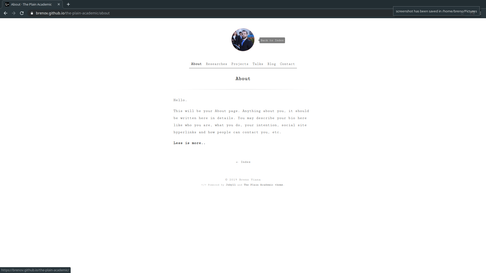
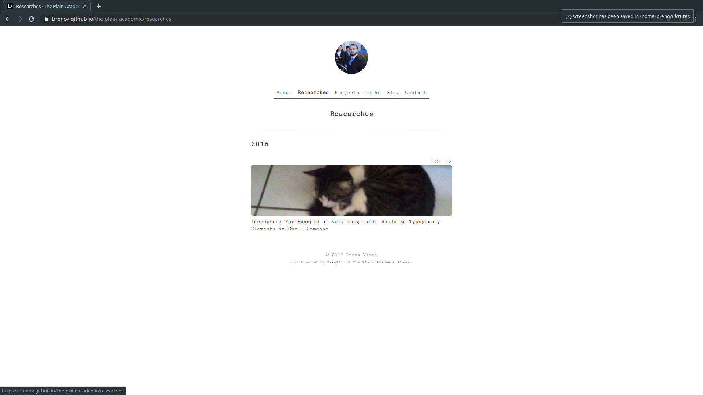
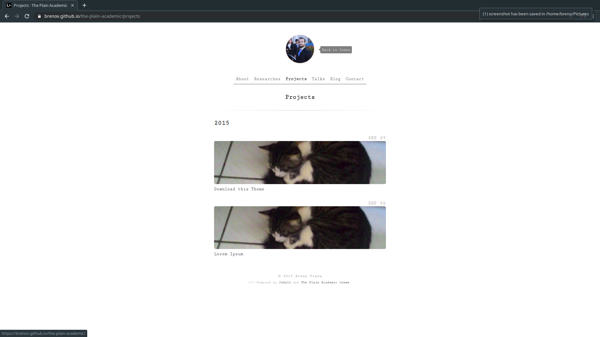
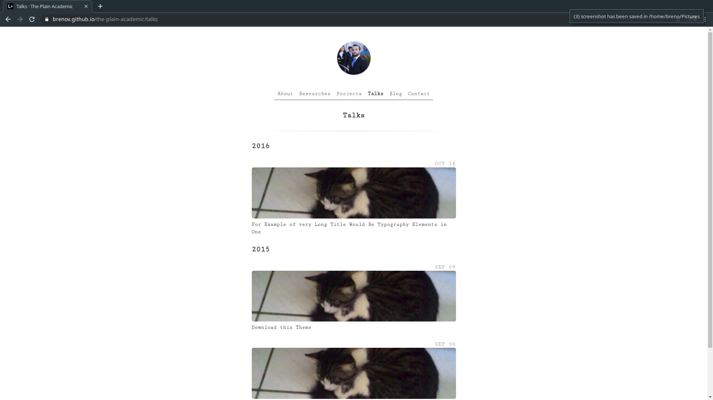
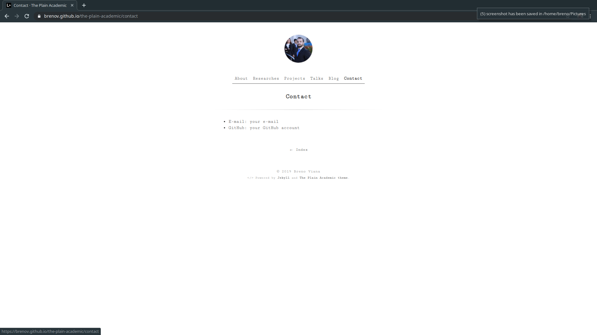
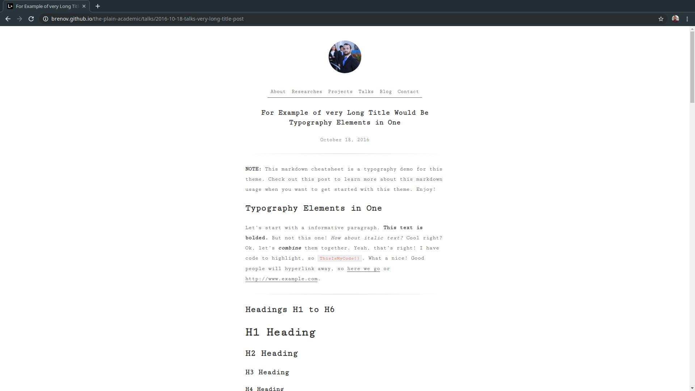

# The Plain Academic

> The Plain Academic is a minimalist Jekyll theme, ideally designed for your academic site. This theme is a modified version of the [The Plain](https://github.com/heiswayi/the-plain).

 

- **Demo:** https://brenov.github.io/the-plain-academic/

### On GitHub

GitHub - for your user account pages or repository gh-pages - only supports a limited set of themes.

Therefore, you need to use the 'remote\_theme:' setting instead of 'theme:', which is supported by [a 3rd party plugin](https://github.com/benbalter/jekyll-remote-theme).

Put this in your *Gemfile*:

	gem 'jekyll-remote-theme'

and run `bundle install` to install the plugin.

Add the following to your site's *_config.yml* to activate the plugin and to select this theme:

	plugins:
	  - jekyll-remote-theme

	remote_theme: heiswayi/the-plain

This will grab the theme directly from the GitHub repo.

Now copy some of the settings from this repo's *_config.yml* file to your own, and modify them.

## Authors

- [**Breno Viana**](https://brenomfviana.github.io/);
- [**Heiswayi Nrird**](https://heiswayi.nrird.com) (the author of [The Plain](https://github.com/heiswayi/the-plain)).

See also the list of [contributors](https://github.com/brenov/the-plain-academic/graphs/contributors) who participated in the this project.

## License

This project is licensed under MIT license - see the [MIT](LICENSE) file for details.
